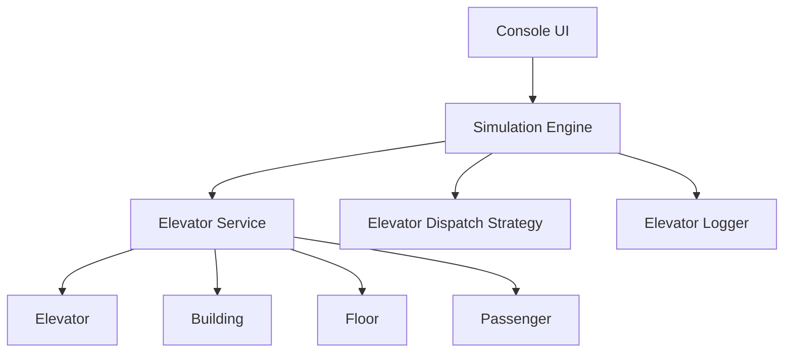
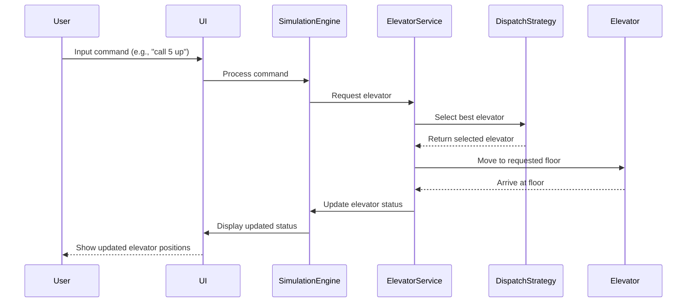

# Elevator Simulation System

## Overview
This project is a console-based elevator simulation system implemented in C#. It simulates the movement of multiple elevators within a building, handling passenger requests, and optimizing elevator dispatching.

## Features
- Real-time elevator status display
- Multiple elevators and floors support
- Interactive elevator control through console commands
- Efficient elevator dispatching algorithm
- Passenger limit handling
- Simulated elevator movement and passenger boarding/exit

## System Architecture
The system is built using Clean Architecture principles and follows SOLID design patterns. Here's a high-level overview of the system components:

## How to Run
1. Clone the repository
2. Open the solution in Visual Studio
3. Ensure .NET 8 SDK is install
4. Build the solution
5. Run the ElevatorChallenge.ConsoleApp project

## User Interface
The console-based UI provides real-time information about the elevator system:

The UI displays:
- Current status of each elevator (floor, state, direction, passenger count)
- Floor requests
- Recent system messages
- Available user commands

## Available Commands
- `call <floor> <up/down>`: Call an elevator to a specific floor
- `move <elevatorId> <floor>`: Move a specific elevator to a floor
- `add <floor> <destFloor>`: Add a passenger at a floor with a destination
- `quit`: Exit the simulation

## System Flow
Here's a simplified flow of how the system processes a passenger request:

## Future Improvements
- Graphical user interface
- More sophisticated dispatching algorithms
- Elevator maintenance scenarios
- Peak time traffic handling

## Extras
GitHub Actions workflow is set: .github/workflows/auto-pr-merge.yml

This enhanced workflow includes the following checks:

1. Setup .NET: This step sets up the .NET environment.
2. Restore dependencies: This step restores any NuGet packages your project depends on.
3. Build: This step builds your project without restoring dependencies (since we've already done that).
4. Run unit tests: This step runs all unit tests in your project.
5. Run code coverage: This step runs the tests again, collecting code coverage information.
6. Upload coverage to Codecov: This step uploads the code coverage report to Codecov, a service that provides code coverage visualization and tracking.

The workflow is structured into two jobs:

1. build-and-test: This job runs all the checks.
2. create-pr-and-merge: This job creates and merges the PR, but only if the build-and-test job succeeds.
